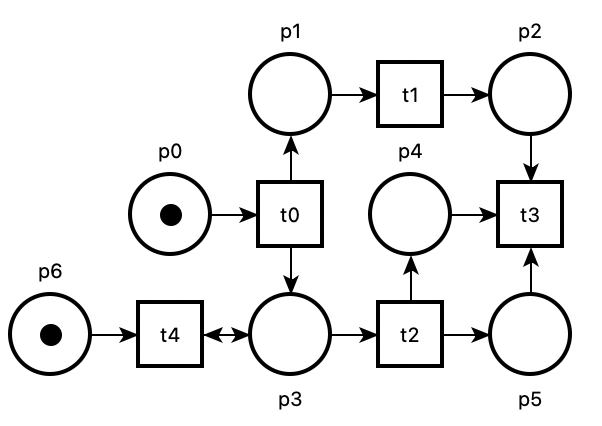
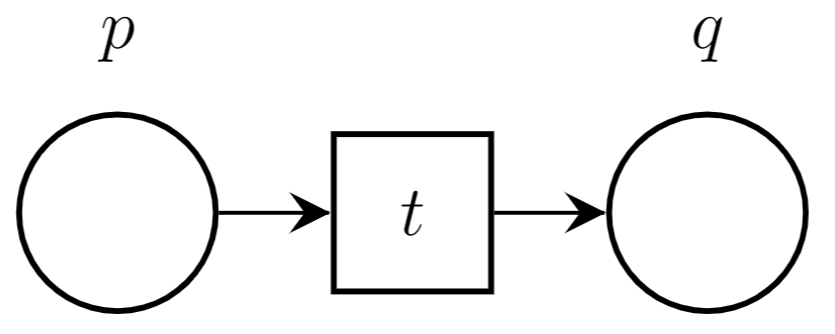

# µSMPT - *An SMT-based Model Checking Project*

The goal of this project is to showcase the application of SMT-based (Satisfiability Modulo Theories) methods in system verification by developing a Petri net model checker that solves the reachability problem. As a developer, you will have the opportunity to participate in the reachability category of the [Model Checking Contest](https://mcc.lip6.fr/2023/), an international competition for model checking tools, and put your skills to the test.

## 1 - Theoretical Background

We start by introducing some key concepts that are useful in the context of this project.

### 1.1 - Model Checking Overview

Model Checking is a formal method for checking whether a model of a system meets a given specification. A (property) *specification* describes the properties of interest, like for instance the states or events that are forbidden. A *model* defines the idealized behavior of the system and how it interacts with the external world. This technique can be used at different stages of systems development (design, architecture, etc.) and, in its simplest form, can be described as an exhaustive exploration of all the states that the system can take. In this project, we focus on *reachability properties* (sometimes also called safety properties), meaning properties about the states that the system can reach.

Model Checking is composed of three main elements to perform verification:

+ *A property specification language*, that is a formalism to describe the properties. Different temporal logics can be used, such as LTL (Linear Temporal Logic) or CTL (Computation Tree Logic).
+ *A behavioral specification language*, that is a formalism to describe the system and its behavior. A model-checker can work with different formalisms, such as networks of automata, process calculi, Petri net, and many others.
+ *A verification technique*, that is a method to prove that the system satisfies the given properties or return a counter-example if it is not the case. Besides "traditional" enumerative or automata-based techniques, two main approaches can be found: a first one based on the use of decision diagrams (such as Binary Decision Diagrams); and a second one based on an encoding into a SAT (or SMT) problem.

### 1.2 - Petri Nets

*Petri nets*, also called *Place/Transition (P/T) nets*, are a mathematical model of concurrent systems defined by Carl Adam Petri. The idea is to describe the state of a system using *places*, containing tokens. A change of state of the system is represented by *transitions*. Places are connected to transitions by *arcs*. If a condition on the number of tokens in the *inputs places* is met, the transition can *fire*, in this case some tokens are removed from the *input places*, and some are added to the *output places*. Basically, places are a representation of the states, conditions, and resources of a system, while transitions symbolize actions. A complete formalization of Petri nets can be found in [[Murata, 1989]](http://people.disim.univaq.it/~adimarco/teaching/bioinfo15/paper.pdf); see also the online resources at the [Petri Nets world](https://www2.informatik.uni-hamburg.de/TGI/PetriNets/index.php).

<br />
<p align="center">
  <a>
    
  </a>
</p>

#### 1.2.1 - Syntax

A Petri net $N$ is a 4-tuple $(P, T, \mathrm{Pre}, \mathrm{Post})$ where:

+ $P = \{p_1, \dots, p_n\}$ is a finite set of places,
+ $T = \{t_1, \dots, t_k\}$ is a finite set of transitions disjoint from the set of places $(P \cap T = \emptyset)$,
+ $\mathrm{Pre} : T \rightarrow (P \rightarrow \mathbb{N})$ is the pre-condition function,
+ $\mathrm{Post} : T \rightarrow (P \rightarrow \mathbb{N})$ is the post-condition function.

#### 1.2.2 - Useful Notations

The *pre-set* of a transition $t \in T$ is denoted ${}^{\bullet} t = \{p \in P \mid \mathrm{Pre}(t,p) > 0 \}$. Symmetrically, the *post-set* of a transition $t$ is denoted $t^{\bullet} = \{ p \in P \mid \mathrm{Post}(t,p) > 0 \}$. The mappings $\mathrm{Pre}(t,p)$ and $\mathrm{Post}(t,p)$ define the weight of arcs between $p$ and $t$. A Petri net is called *ordinary* when the (non-zero) weights on all arcs are equal to $1$.

These notations can be extended to the *pre-set* and *post-set* of a place $p$, with ${}^{\bullet} p = \{ t \in T \mid \mathrm{Post} (t,p) > 0 \}$ and $p^{\bullet} = \{ t \in T \mid \mathrm{Pre}(t,p) > 0 \}$.

Given a set of constants $A$, we define the set of *finite sequences* on $A$ to be the free monoid $A^\star$, where $\epsilon$ stands for the "empty sequence". We will use $s \cdot s'$ for the concatenation operation between sequences, that we should often write $s\, s'$.

#### 1.2.3 - Markings and Reachability Set

A marking of a Petri net $(P, T, \mathrm{Pre}, \mathrm{Post})$ is a mapping $m : P \rightarrow \mathbb{N}$, which assigns a number of tokens to each place. Hence $m(p)$ is the number of tokens for place $p$ in $m$. We say that $m$ is a marking over $N$, or even simply a marking over $P$.

A marked Petri net is a tuple $(N, m_0)$ where $N$ is a Petri net and $m_0$ is the initial marking.

A transition $t \in T$ is *fireable* or *enabled* in a marking $m \in \mathbb{N}^P$, denoted $m \xrightarrow{t}$, if and only if $m(p) \ge \mathrm{Pre}(t,p)$ for all place $p$ in ${}^{\bullet}t$.

A marking $m' \in \mathbb{N}^P$ is reachable from a marking $m \in \mathbb{N}^P$ by firing transition $t$, denoted $m \xrightarrow{t} m'$, if: (1) transition $t$ is enabled at $m$; and (2) for all place $p$ in P, we have $m'(p) = m(p) - \mathrm{Pre}(t,p) + \mathrm{Post}(t,p)$.

We say that a *firing sequence* $\sigma = t_1\, \dots\, t_n \in T^*$ can be fired from an initial marking $m_0$, denoted $m_0 \xRightarrow{\sigma} m$, if there exists markings $m_1, \dots, m_n$ such that $m = m_n$ and $m_i \xrightarrow{t_{i+1}}m_{i+1}$ for all $i \in 1..n$. We denote $R(N, m_0)$ the set of markings reachable from $m_0$ in the net $N$.

#### 1.2.4 - Classification: Safe Nets

A marked Petri net $(N, m_0)$ is called *safe* when, for all reachable marking $m$ (in $R(N, m_0)$) we have $m(p) \le 1$ for all places $p$ in $P$. In other words, for all reachable markings, the marking of a place is always bounded by $1$.

### 1.2.5 - Graphical syntax

A Petri net can be represented graphically: places are represented by circles, transitions by squares, and arcs by arrows.  Black dots inside a place are used to represent tokens in the marking of a place. In our example, transition $t_0$ is fireable, because place $p_0$ has a token.

### 1.3 - Reachability Formulas

We are interested in the verification of *safety properties* over the reachable markings of a marked net $(N, m_0)$, with set of places $P$. Given a formula $F$ with variables in $P$, we say that $F$ is reachable if there exists at least one reachable marking, $m \in R(N, m_0)$, such that $m \models F$. We call such marking a *witness* of $F$. Conversely, a formula $G$ is said *invariant* if it holds on all the reachable markings of $(N, m_0)$ (or, equivalently, if $\neg G$ is not reachable). Example of properties we can express in this way include: checking if some transition $t$ is enabled (commonly known as quasi-liveness); checking if there is a deadlock; checking whether some linear invariant between places is always true; etc.

# 2. Instructions

In the `usmpt/` directory you will find all the Python code to build your own model-checker. The parsers and data-structure are already written. Of course, you can modify any part of the code if you feel the need.

## 2.1 - Running the Tool

The tool must be runned as a Python package, using the command `python3 -m usmpt`. Option `--help` will output how to use it:

```
$ python3 -m usmpt --help
usage: __main__.py [-h] [--version] [-v] [--debug] -n ptnet (-ff PATH_FORMULA | -f FORMULA) --methods
                   [{STATE-EQUATION,INDUCTION,BMC,K-INDUCTION,DUMMY} ...] [--timeout TIMEOUT] [--show-time] [--show-model]

uSMPT: An environnement to experiment with SMT-based model checking for Petri nets

options:
  -h, --help            show this help message and exit
  --version             show the version number and exit
  -v, --verbose         increase output verbosity
  --debug               print the SMT-LIB input/output
  -n ptnet, --net ptnet
                        path to Petri Net (.net format)
  -ff PATH_FORMULA, --formula-file PATH_FORMULA
                        path to reachability formula
  -f FORMULA, --formula FORMULA
                        reachability formula
  --methods [{STATE-EQUATION,INDUCTION,BMC,K-INDUCTION,DUMMY} ...]
                        enable methods among STATE-EQUATION INDUCTION BMC K-INDUCTION DUMMY
  --timeout TIMEOUT     a limit on execution time
  --show-time           show the execution time
```

Basically, `usmpt` takes as input a Petri net in the `.net` format (see [documentation](https://projects.laas.fr/tina/manuals/formats.html#2)), and a formula defined using the following syntax:

```
<expression> ::= "T" (true) | "F" (false) | <atom> | 
                  - <expression> (logic negation) | <expression> /\ <expression> (conjunction) | <expression> \/ <expression> (conjunction)

<atom>       ::= <atom> <comparison> <atom>

<member>     ::= <integer> | <place-identifier> | <integer> "*" <place-identifier> | <member> + <member>

<integer>    ::= [0-9]+

<comparison> ::= "<=" | ">=" | ">" | "<" | "=" | "!="
```

When dealing with formulas on safe nets, we restrict the comparison operators to `=` and `!=` and the semantics of `+` corresponds to the logical `or`, `1` to `T` and `0` to `F`.

You will find some examples of nets and formulas in the `nets/` directory, and their graphical representation in the `pics/` directory. You can draw, edit and play with the net using the `nd` editor from the [Tina toolbox](https://projects.laas.fr/tina/).

Running `python3 -m usmpt -n <path_net> -ff <path_formula> -v --methods DUMMY` will output the net and the formula (`--methods DUMMY` permits to do not select any method).

More generally, the files in the project are organized as follow; only the files with an asterisk `(*)` are intended to be modified:

```
usmpt/

    smpt.py                 # main script

    ptio/
        ptnet.py            # Petri net module                                (*)
        formula.py          # Formula module
        verdict.py          # Verdict module
        
    checkers/
        abstractchecker.py  # abstract class of model checking methods
        bmc.py              # template for the Bounded Model Checking method
        induction.py        # template for the inductive method               (*)
        kinduction.py       # template for the k-induction method             (*)
        stateequation.py    # template for the state-equation method          (*)

    interfaces/
        solver.py          # abstract class for solver interface
        z3.py              # interface to the z3 solver

    exec/
        parallelizer.py    # module to manage the parallel execution of methods
        utils.py           # some utils for managing process and verbosity
```

During the project you can use any SAT/SMT solver. However, `usmpt` already provides an interface with the [z3 solver](https://github.com/Z3Prover/z3), using the SMT-LIB format. You will find documentation at the end of this file in Appendix.

During the project, do not hesitate to use the `-verbose` and `--debug` options extensively, which output some information about the execution and the SMT-LIB exchanged with the solver (including what is returned by the solver).

Finally, to automatically install the Tina toolbox and the z3 solver, run the `install.sh` script, followed by `source ~/.bashrc` to update the `PATH` environment variable.


## 2.2 - Defining Predicates

We start by defining a few formulas (on paper first) that ease the subsequent expression of model checking procedures. This will help you with the most delicate point of our encoding, which relies on how to encode sequences of transitions.

Since places can contain an a arbitrary number of tokens, our encoding will rely on the Linear Integer Arithmetic (LIA) theory, i.e., variables are nonnegative integers (in $\mathbb{N}$). However, if we know (as a pre-condition) that a net is safe, it may be more efficient to rely on a Boolean encoding (and thus use a pure SAT solver). This part, is kept as an extension (see Sect. 2.3.5). Note that in the `nets/` folder, safe nets are always named `safe_net.net` and otherwise `net.net`.

In the following, we use $\vec{x}$ for the vector of variables $(x_1, \dots, x_n)$, corresponding to the places $p_1, \dots, p_n$ of $P$, and $F(\vec{x})$ for a formula whose variables are included in $\vec{x}$. We say that a mapping[^1] $m$ of $\mathbb{N}^{P}$ is a model of $F$, denoted $m \models F$, if the ground formula $F(m) = F(m(p_1), \dots, m(p_n))$ is true. Hence, we can also interpret $F$ as a predicate over markings.

We start by considering that nets are safe. Hence we can work with Boolean variables (a place contains one token or not), and thus Boolean predicates.

<table><tr><td style="vertical-align: middle;">❓</td>
<td>

> **Task:** Define the predicate $\underline{m}(\vec{x})$, given a marking $m$, which models exactly $m$ (this predicate admits only one model that is $m$).
</td></tr></table>

<table><tr><td style="vertical-align: middle;">❓</td>
<td>

> **Task:** Define the predicate $\mathrm{ENBL}_t(\vec{x})$, given a transition $t$, which models exactly the markings that enable $t$.
</td></tr></table>

For the following question, you can define another helper predicate, $\Delta_t(\vec{x}, \vec{x'})$ encoding the token displacement from $\vec{x}$ to $\vec{x}'$ by firing some transition $t$.

<table><tr><td style="vertical-align: middle;">❓</td>
<td>

> **Task:** Define a predicate $\mathrm{T}(\vec{x}, \vec{x}')$ that describes the relation between the markings before $(\vec{x})$ and after $(\vec{x'})$ firing a transition. With this convention, formula $\mathrm{T}(\vec{x}, \vec{x}')$ holds if and only if $x \xrightarrow{t} x'$ holds for some transition $t$.
</td></tr></table>

In this project, these predicates are generated using the SMT-LIB format, see the appendix for more details.

## 2.3 - Implementing SMT-based model checking methods

Our next step is to implement some model checking methods that will make use of the predicate $\mathrm{T}(\vec{x}, \vec{x}')$. To define multiple vectors of variables, namely $\vec{x^0}, \vec{x^1}, \vec{x^2}$, we suggest using `@k` as a suffix for each place identifier. For example, variables in the vector $\vec{x}^1 \triangleq (x_0^1, \dots, x_n^1)$ will be named as `x0@1, ..., xn@1`. It is important to note that the parameter `k` is already an argument of the various `smtlib` methods of the codebase (see for example the `smtlib_declare_places(self, k: Optional[int] = None) -> str` method in `usmpt/ptio/ptnet.py`, which declares a new non-negative integer variable for each place, indexed by $k$).

### 2.3.1 - Bounded Model Checking (BMC)

The *Bounded Model Checking* analysis method, or *BMC* for short, is an iterative method exploring the state-space of finite-state systems by unrolling their transitions [[Biere et al., 1999]](http://fmv.jku.at/papers/BiereCimattiClarkeZhu-TACAS99.pdf). The method was originally based on an encoding of transition systems into (a family of) propositional logic formulas and the use of SAT solvers to check these formulas for satisfiability. More recently, this approach was extended to more expressive models, and richer theories, using SMT solvers.

In BMC, we try to find a reachable marking $m$ that is a model for a given formula $F$. The algorithm starts by computing a formula, say $\phi_0$, representing the initial marking (hence $\phi_0 \triangleq \underline{m_0}$) and checking whether $\phi_0 \land F$ is satisfiable (meaning $F$ is initially true). If the formula is *UNSAT*, we compute a formula $\phi_1$ representing all the markings reachable in one step, or less, from the initial marking and check $\phi_1 \land F$. This way, we compute a sequence of formulas $(\phi_i)_{i \in \mathbb{N}}$ until either $\phi_i \land F$ is *SAT* (in which case a witness is found) or we have $\phi_{i+1} \Rightarrow \phi_i$ (in which case we reach a fixpoint and no counter-example exists).

The BMC method is not complete since it is not possible, in general, to bound the number of iterations needed to give an answer. Also, when the net is unbounded, we may very well have an infinite sequence of formulas $\phi_0 \subsetneq \phi_1 \subsetneq \dots$ However, in practice, this method can be very efficient to find a witness when it exists.

The crux of the method is to compute formulas $\phi_i$ that represents the set of markings reachable using firing sequences of length at most $i$. Your goal is to build such formulas incrementally.

We give, below, a brief pseudocode description of the algorithm.

```
x   <- freshVariables()
phi <- m0(x)

while unsat(phi /\ F(x)) {
    x'  <- freshVariables() 
    phi <- phi /\ T(x, x') 
    x <- x'
}

return True
```

The BMC method is already implemented in the `prove_helper(self) -> int` method of the `BMC` class (see, `usmpt/checkers/bmc.py`). This method returns the iteration index if a witness is found, otherwise it does not terminate.

This implementation relies on three methods of the `PetriNet class` (see, `usmpt/ptio/ptnet.py`):
`smtlib_declare_places`, `smtlib_set_initial_marking` and `smtlib_transition_relation`.

To run BMC you must select it using `--methods BMC`.

<table><tr><td style="vertical-align: middle;">❓</td>
<td>

> **Task:** Implement the methods `smtlib_set_initial_marking` and `smtlib_transition_relation`, which return an SMT-LIB encoding (`str`) of the predicates $\underline{m_0}(\vec{x^k})$ and $\mathrm{T}(\vec{x}^k, \vec{x}^{k+1})$ respectively.

> **Tip:** Read the methods `__str__` and `smtlib_declare_places` carefully to understand the data-structure of a Petri net. The attributes `self.places` and `self.transitions` are the sets of identifiers of the places and transitions respectively. The pre- and post-conditions are stored as two nested dictionaries (`self.pre` and `self.post`). For example, if `self.pre[t][p]` is defined, its value corresponds to the weight of the arc from $p$ to $t$, otherwise `p` is not a valid key of `self.pre[t]` and no such arc exists. Note that in Python you can use `self.pre[t].get(p, 0)` to get `self.pre[t][p]` if `p` is a valid key and `0` otherwise.

> **Testing:** `python3 -n nets/BMC/safe_net.net -ff nets/BMC/reachable.formula --methods BMC` must return `REACHABLE` and `python3 -n nets/INDUCTION/safe_net.net -ff nets/INDUCTION/not_reachable.formula --methods BMC` must not terminate (use CTRL-C to stop the execution). Write other tests to check your implementation.
</td></tr></table>


### 2.3.2 - Induction

Induction is a basic method that checks if a property is an inductive invariant. This property is "easy” to check, even though interesting properties are seldom inductive.

To prove that property $F$ is not reachable (no reachable state satisfies $F$), it is sufficient to prove that $\neg F$ is inductive, or equivalently that the following two properties hold:

1. $\underline{m_0}(\vec{x}) \land F(\vec{x})$ is *UNSAT*; and
2. $\neg F(\vec{x}) \land T(\vec{x}, \vec{x'}) \land F(\vec{x'})$ is *UNSAT*.

Note that checking condition (2) is equivalent to proving that $\left ( \neg F(\vec{x}) \land T(\vec{x}, \vec{x}') \right) \Rightarrow \neg F(\vec{x}')$ is a tautology.

Note that to run Induction you must select it using `--methods INDUCTION`.

<table><tr><td style="vertical-align: middle;">❓</td>
<td>

> **Task:** Implement the `prove_helper(self) -> Optional[bool]` method of the `Induction` class that returns `True` if constraint (1) is *SAT* (i.e. the initial marking is a model of $F$); returns `False` if both constraints (1) and (2) are *UNSAT* (i.e. $\neg F$ is an invariant); and returns `None` otherwise.

> **Tip:** Read the BMC implementation in `usmpt/checkers/bmc.py` carefully.

> **Testing:** `python3 -n nets/INDUCTION/net.net -ff nets/INDUCTION/not_reachable.formula --methods INDUCTION` must return `NOT REACHABLE` and `python3 -n nets/K-INDUCTION/net.net -ff nets/K-INDUCTION/not_reachable.formula --methods INDUCTION` must terminate without computing a verdict (`UNKNOWN`).
</td></tr></table>

### 2.3.3 - K-Induction

K-Induction is an extension of the BMC and Induction methods, that can also prove that a formula is not reachable [[Sheeran et al., 2000]](https://www.di.ens.fr/~pouzet/cours/mpri/bib/sheeran-FMCAD00.pdf). Sometimes, $\neg F$ may not be inductive by unrolling only one transition (and so the Induction method will return `None`).

For example, $F \triangleq (q \neq 0)$ is clearly not reachable in the (dead) net depicted below (and so $\neg F = (q = 0)$ is an invariant). Yet, condition 2. of the induction does not hold: $(p = 1 \land q = 0) \xrightarrow{t} (p' = 0 ∧ q' = 1)$. However, by considering sequences of $k$ transitions, this invariant can be shown to hold: $\models \forall \vec{p}, \vec{p}', \vec{p}''. \, F(\vec{p}) \land \mathrm{T}(\vec{p}, \vec{p}′) \land \neg F(\vec{p}') \land \mathrm{T}(\vec{p}, \vec{p}'') \Rightarrow \neg F(\vec{p}'')$. In this case, we say that property $F$ is 2-inductive.

<br />
<p align="center">
  <a>
    
  </a>
</p>

The algorithm starts by computing a formula $\psi_0(\vec{x_0}, \vec{x_1}) \triangleq \neg F(\vec{x_0}) \land T(\vec{x_0}, \vec{x_1})$, and check whether $\psi_0(\vec{x_0}, \vec{x_1}) \land F(\vec{x_1})$ is *UNSAT* or not. If it is *UNSAT*, we must ensure that the first iteration (i = 0) of BMC does not find a witness. If not, we proved that $\neg F$ is an invariant with exactly the same queries as the induction method. In the other case, if $\psi_0(\vec{x_0}, \vec{x_1}) \land F(\vec{x_1})$ is *SAT*, we continue by unrolling the transitions and computing a formula $\psi_1$ representing the states reachable by firing two transitions consecutively from $\neg F$ as : $\psi_1(\vec{x_0}, \vec{x_1}, \vec{x_2}) \triangleq \psi_0(\vec{x_0}, \vec{x_1}) \land \neg F(\vec{x_1}) \land T(\vec{x_1}, \vec{x_2})$ and check whether $\psi_1 \land F(\vec{x_2})$ is *UNSAT* or not.

The interconnection between `BMC` and `KInduction` is already implemented in `usmpt` through the attribute `induction_queue`. The `prove_helper` method of `BMC` must manage the result of `KInduction` if there is one.

Note that to run Induction you must select it using `--methods K-INDUCTION`.

<table><tr><td style="vertical-align: middle;">❓</td>
<td>

> **Task:** Implement the `def prove_helper(self) -> int` of the `KInduction` class, that iteratively constructs the $\psi_i$ formulas and returns $i$ if $\psi_i \land F$ is *UNSAT*.

> **Testing:** `python3 -n nets/K-INDUCTION/net.net -ff nets/K-INDUCTION/not_reachable.formula --methods K-INDUCTION` must return `NOT REACHABLE`.
</td></tr></table>

### 2.3.4 - State Equation Over-Approximation

We know propose a method specific to Petri nets. This method relies on the *potentially reachable markings* (an over-approximation of the reachable markings), that are the solutions of $m$ for the system $I \cdot \vec{z} + m_0 = m$, where $\vec{z}$ is a vector of non-negative variables and $I$ is the incidence matrix. The incidence matrix $I$ of a net $N$ is the integer matrix of dimension $|P| \times |T|$ (place-transition) with components $I(p, t) = \mathrm{Post}(t, p) − \mathrm{Pre}(t, p)$, for each place $p$ and each transition $t$. This method (as the previous ones) is still non-complete, but it can help us prove, in some cases, that a formula $F$ is not reachable.

This part is left as an open problem, and do not rely on the previous encoding.

<table><tr><td style="vertical-align: middle;">❓</td>
<td>

> **Task:** Implement the `prove_helper(self) -> Optional[bool]` method of the `StateEquation` class, that returns `False` is the formula has been proved as non-reachable, `None` otherwise.

> **Hint:** In the `PetriNet` class (`usmpt/ptio/ptnet.py`) you may need to write additional `smtlib` methods.

> **Testing:** Find a net and two (not reachable) formulas, such that the state equation permits to conclude for the first, but not for the second.
</td></tr></table>

### 2.3.5 - SAT encoding for safe nets

As mentioned earlier, if we know, as a pre-condition, that a net is safe, it may be more efficient to rely on a Boolean encoding (and thus use a pure SAT solver). 

<table><tr><td style="vertical-align: middle;">❓</td>
<td>

> **Task:** Write an alternative version of the methods `smtlib_declare_places`, `smtlib_set_initial_marking` and `smtlib_transition_relation` to support a SAT encoding for the specific case of safe nets.

> **Hint:** Replace occurrences of `formula.smtlib` with `formula.smtlib_sat` (see the definition of `smtlib_sat` in `usmpt/ptio/formula.py` on line 103).

> **Testing:** Tests must still work if they are based on `safe_net.net`, otherwise they must be rewritten. 
</td></tr></table>

---

## Appendix: Using the z3 interface with the SMT-LIB Format

SMT-LIB (Satisfiability Modulo Theories LIBrary) is an interface language intended for use by programs designed to solve SMT (Satisfiability Modulo Theories) problems. You can find a complete documentation on the [official website](https://smtlib.cs.uiowa.edu/papers/smt-lib-reference-v2.6-r2021-05-12.pdf).

Given a `z3` object (attribute `solver` in any `AbstractChecker` object) you can use several helper methods:

+ `write(str) -> None`: write some instructions to the solver,
+ `reset() -> None`: erase all assertions and declarations,
+ `push() -> None`: creates a new scope by saving the current stack size,
+ `pop() -> None`: removes any assertion and declaration performed between it and the last `push`,
+ `check_sat() -> Optional[bool]`: returns if the current stack is satisfiable or not (a result of `None` means that there is an error with the stack).

You can use option `--debug` of `usmpt` to display the exchanges between the program and the solver on the standard output.

You can try with some SMT-LIB queries on some online platforms such as [Z3 Playground](https://jfmc.github.io/z3-play/) or [Z3 Online Demonstrator](https://compsys-tools.ens-lyon.fr/z3/).

An example of Boolean declarations and SAT assertions:

```
; Variable declarations
(declare-fun a () Bool)
(declare-fun b () Bool)
(declare-fun c () Bool)

; Constraints
(assert (or a b))
(assert (not (and a c)))

; Solve
(check-sat)
```

An example of Integer declarations and QF-LIA assertions:

```
; Variable declarations
(declare-fun a () Int)
(declare-fun b () Int)
(declare-fun c () Int)

; Constraints
(assert (> a 0))
(assert (> b 0))
(assert (> c 0))
(assert (= (+ a b) (* 2 c)))
(assert (distinct a c))

; Solve
(check-sat)
```

Note that the `!=` operator in SMT-LIB is `distinct`.

---

[^1] In the subject, we will use the two notations $A \rightarrow B$ and $B^A$ interchangeably, for the type of mappings from $A$ to $B$.
